DAY 2 =# End-to-End CI/CD Pipeline for PHP Application on Microsoft Azure

## Azure App Service + Azure DNS + GitHub Actions + Zero-Downtime Deployment

---

## Project Overview

This project demonstrates a production-ready CI/CD pipeline for deploying a PHP web application to Microsoft Azure using:

- Azure App Service (Linux)
- Azure Deployment Slots
- Azure DNS
- GitHub Actions
- Azure CLI
- Service Principal Authentication

The pipeline enables:

- Automated deployments
- Zero-downtime releases
- Custom domain integration
- HTTPS access
- Enterprise-grade CI/CD automation

---
## CI/CD Workflow

```text
Developer Pushes Code
        ↓
GitHub Repository
        ↓
GitHub Actions Pipeline
        ↓
Build and Package Application
        ↓
Upload Build Artifact
        ↓
Deploy to Azure Staging Slot
        ↓
Swap Staging to Production
        ↓
Zero-Downtime Production Release
        ↓
Azure DNS + Custom Domain
        ↓
End Users Access Application
```

---

## Technologies Used

- PHP
- GitHub Actions
- Microsoft Azure
- Azure App Service
- Azure Deployment Slots
- Azure DNS
- Azure CLI
- Linux App Service Plan

---

## Project Structure

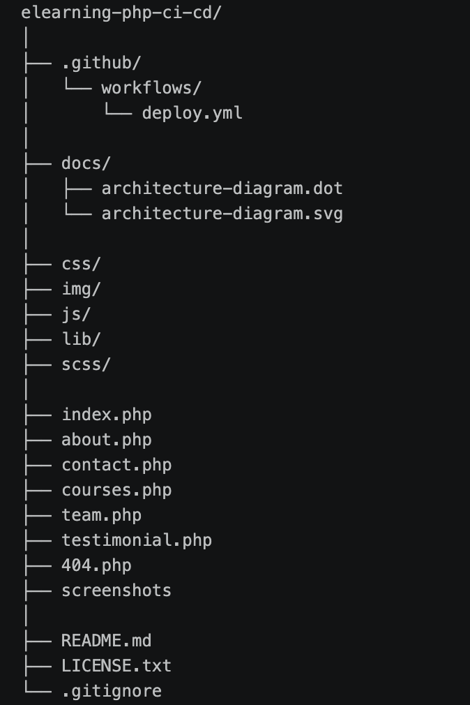
---

# PHASE 0 — CREATE ARCHITECTURE DIAGRAM

# Generate Architecture Diagram

## Step 1 - Install Graphviz locally using Homebrew:

```bash
/bin/bash -c "$(curl -fsSL https://raw.githubusercontent.com/Homebrew/install/HEAD/install.sh)"

brew install graphviz
```
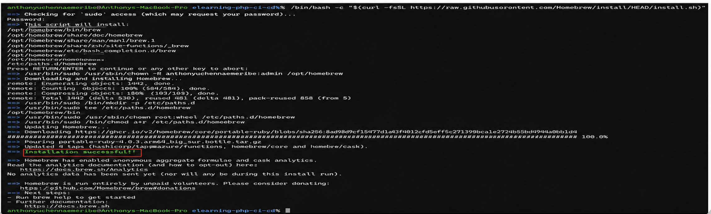


## Step 2 - Verify installation

```bash
dot -V
```
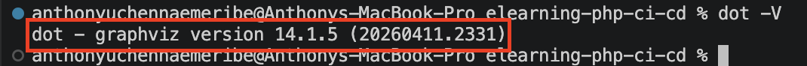


## Step 3 - Create diagram source

```bash
nano docs/architecture-diagram.dot
```

Paste:

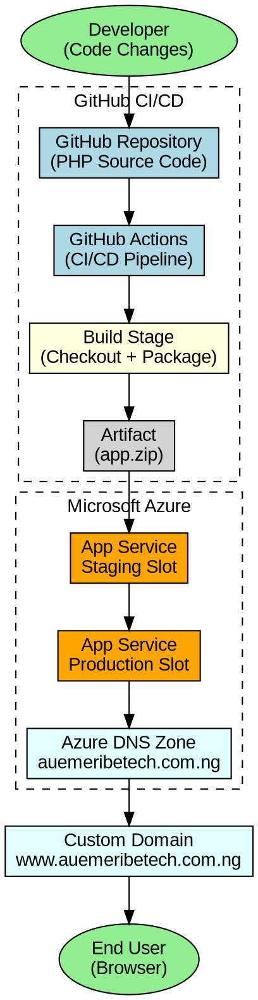
```dot
digraph CICD_Azure_PHP {
    rankdir=TB;
    fontname="Arial";

    node [
        shape=box,
        style=filled,
        fontname="Arial"
    ];

    dev [
        label="Developer\n(Code Changes)",
        shape=ellipse,
        fillcolor="lightgreen"
    ];

    github [
        label="GitHub Repository\n(PHP Source Code)",
        fillcolor="lightblue"
    ];

    actions [
        label="GitHub Actions\n(CI/CD Pipeline)",
        fillcolor="lightblue"
    ];

    build [
        label="Build Stage\n(Checkout + Package)",
        fillcolor="lightyellow"
    ];

    artifact [
        label="Artifact\n(app.zip)",
        fillcolor="lightgrey"
    ];

    staging [
        label="App Service\nStaging Slot",
        fillcolor="orange"
    ];

    production [
        label="App Service\nProduction Slot",
        fillcolor="orange"
    ];

    dns [
        label="Azure DNS Zone\nauemeribetech.com.ng",
        fillcolor="lightcyan"
    ];

    domain [
        label="Custom Domain\nwww.auemeribetech.com.ng",
        fillcolor="lightcyan"
    ];

    user [
        label="End User\n(Browser)",
        shape=ellipse,
        fillcolor="lightgreen"
    ];

    dev -> github;
    github -> actions;
    actions -> build;
    build -> artifact;
    artifact -> staging;
    staging -> production;
    production -> dns;
    dns -> domain;
    domain -> user;

    subgraph cluster_azure {
        label="Microsoft Azure";
        style=dashed;

        staging;
        production;
        dns;
    }

    subgraph cluster_github {
        label="GitHub CI/CD";
        style=dashed;

        github;
        actions;
        build;
        artifact;
    }
}
```
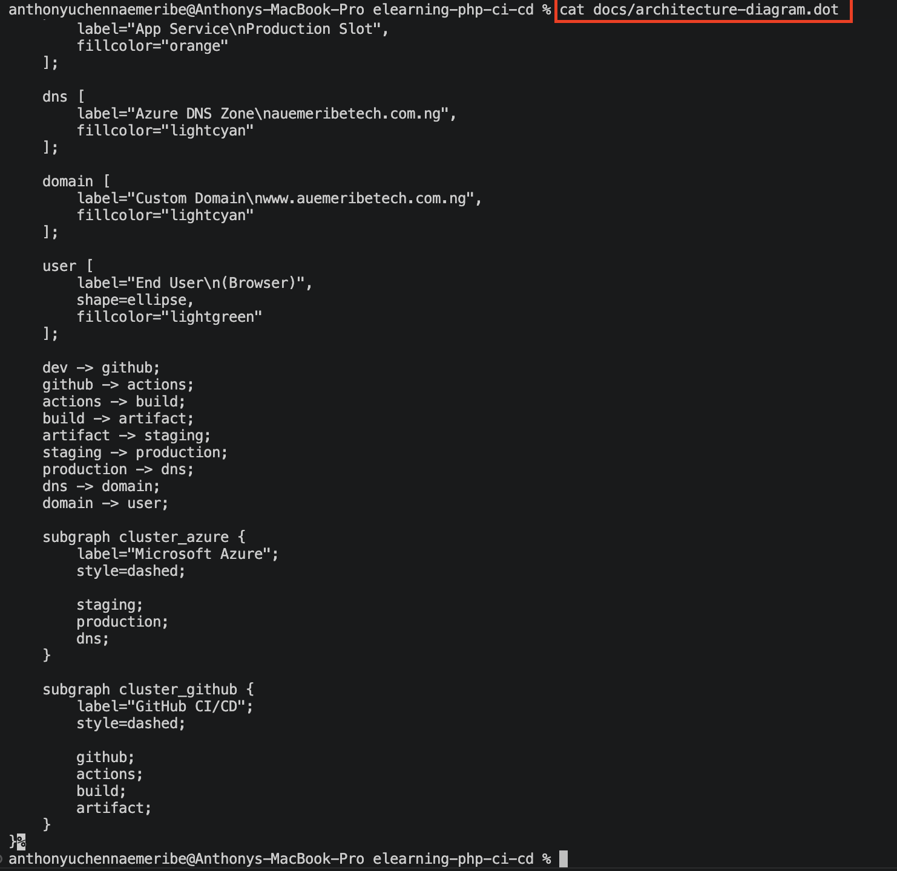

## Step 4 - Generate PNG:
```bash
dot -Tpng architecture-diagram.dot -o architecture-diagram.png
```

## Step 5 - Generate SVG:

```bash
dot -Tsvg architecture-diagram.dot -o architecture-diagram.svg
```
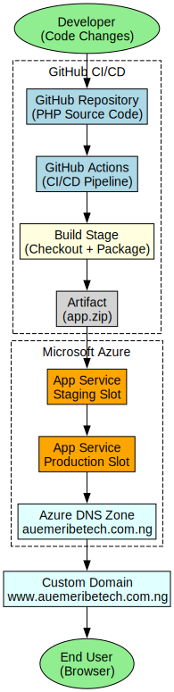

## Step 6 - Create .gitignore file using:
1. Run:
```bash
nano .gitignore
```

2. Paste content of .gitignore

```text
# Node / general
node_modules/

# OS files
.DS_Store
Thumbs.db

# Logs
*.log

# Environment variables
.env

# VS Code
.vscode/

# Build artifacts
*.zip

# Azure / deployment
publish-profile.xml
prod-profile.xml
staging-profile.xml
```
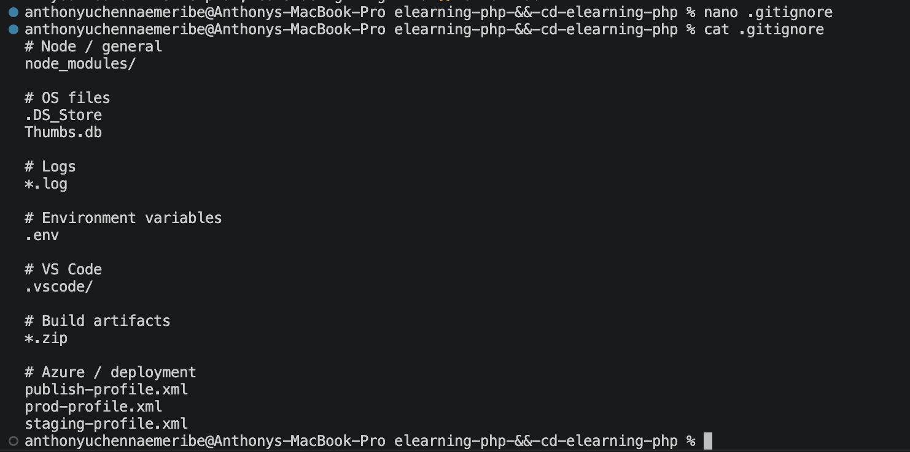
---

 # PHASE 1 — Prepare & Push PHP App

## Step 1 - Login to git
```bash
gh auth login
```
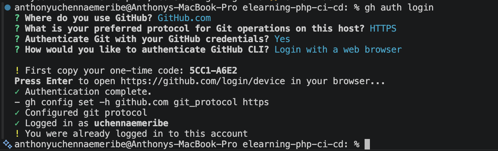

## Step 2 - Initialize Git
1. Create the project directory named:
```text
eleraning-php-ci-cd
```
2. Initialize, add codes, execute screenshot and change branch name:
```bash
git init
git add .
git commit -m "Initial PHP app commit"
git branch -M main
```
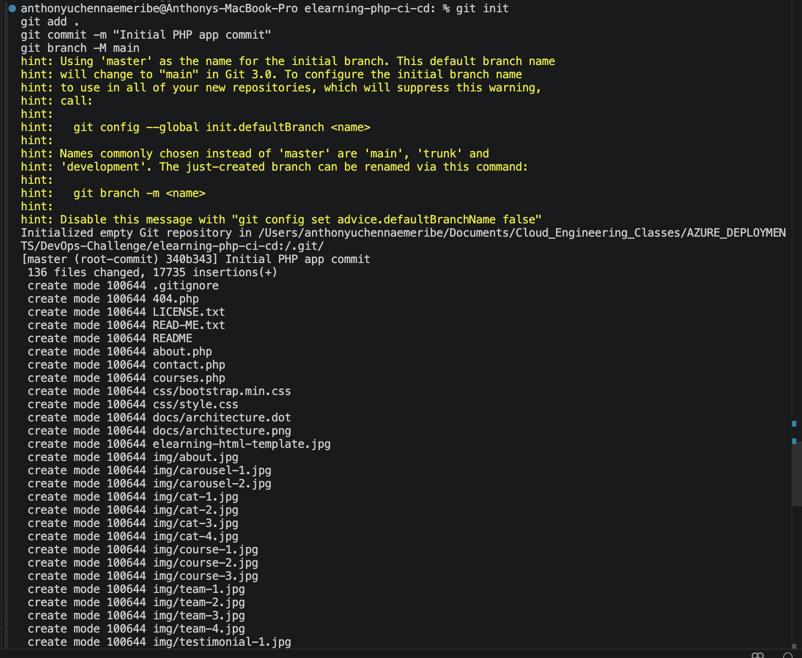

3. Create GitHub Repo
```bash
gh repo create elearning-php --public --source=. --remote=origin --push
```
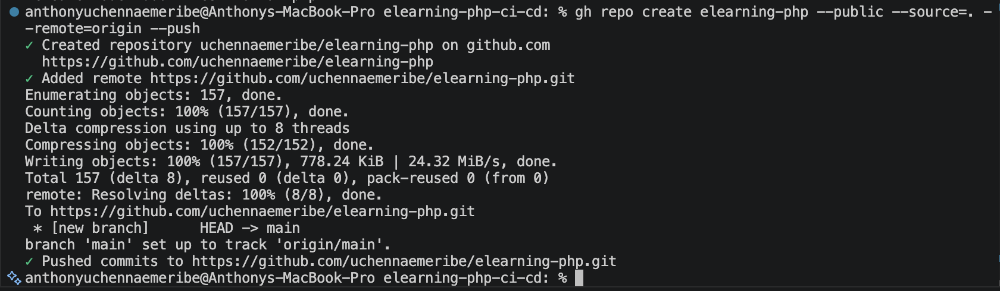

# PHASE 2 - Azure Infrastructure Setup
## 1. Create Resource Group
```bash
az group create --name elearning-rg --location westus3
```
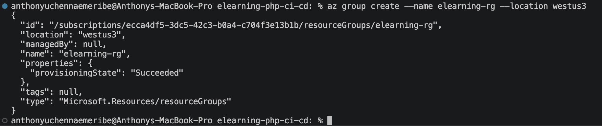
---

## 2. Create App Service Plan(B1 REQUIRED) and upgrading to S1
1. Creating app service plan
```bash
az appservice plan create --name elearning-plan --resource-group elearning-rg --sku S1 --is-linux
```
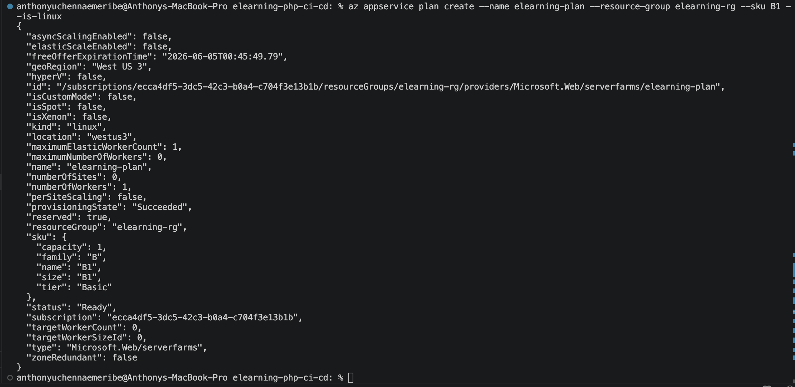

2. Upgrading service plan
```bash
az appservice plan update --name elearning-plan --resource-group elearning-rg --sku S1
```
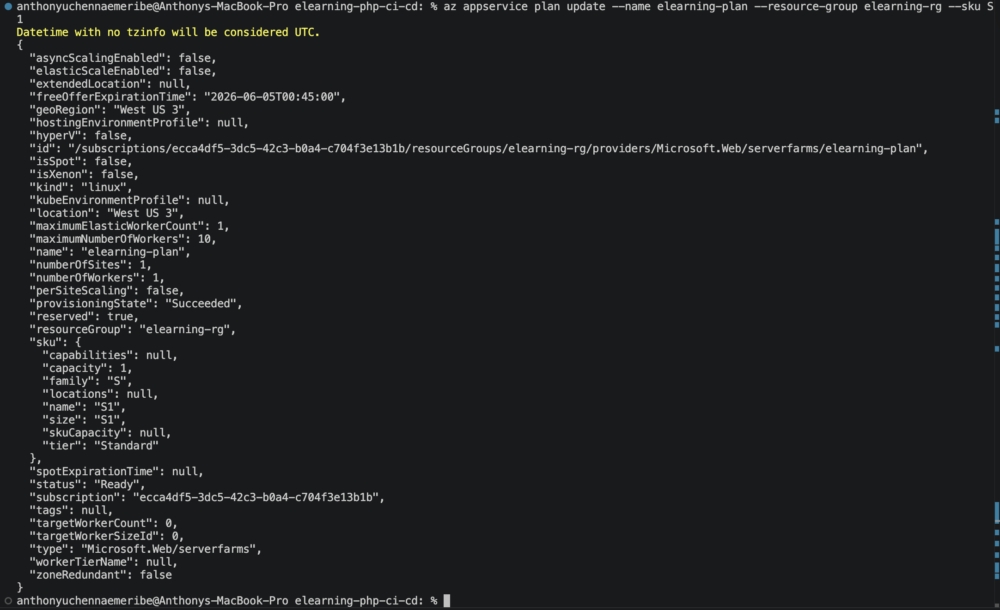
---

## 3. Create PHP Web App

```bash
az webapp create --resource-group elearning-rg --plan elearning-plan --name elearning-app-12345 --runtime "PHP|8.2"
```
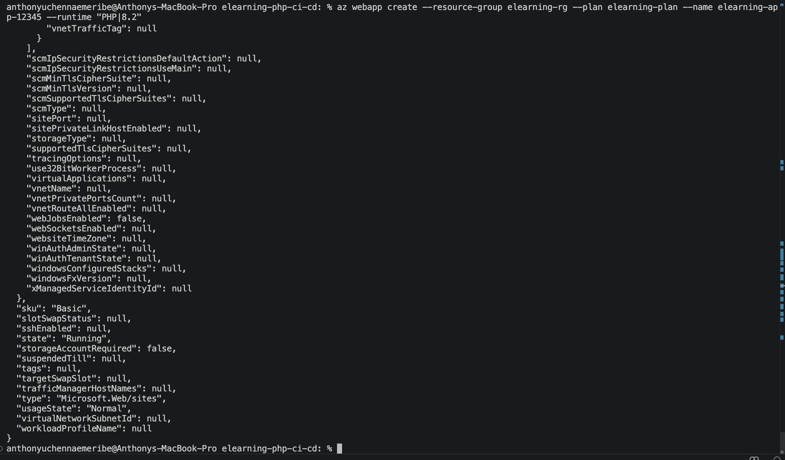
---

## 4. Get Default URL
```bash
az webapp show --name elearning-app-12345 --resource-group elearning-rg --query defaultHostName -o tsv
```
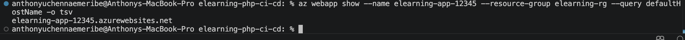

## 5. Browser Verification
Use the browser to test the retrieved link

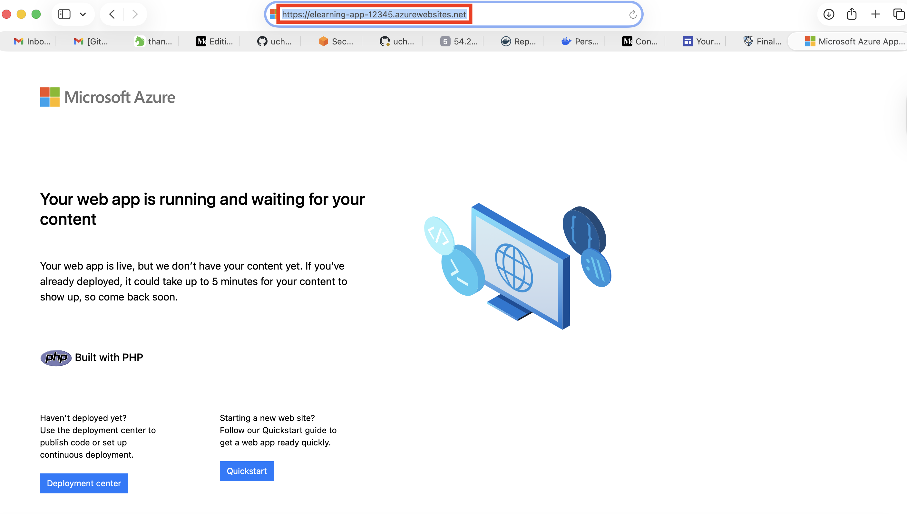

# PHASE 3 — Configure CI/CD

## Step 1 - Create Staging Slot
1. Run:
```bash
az webapp deployment slot create --name elearning-app-12345 --resource-group elearning-rg --slot staging
```
 This enables:
* Safe testing
* Zero-downtime deployment

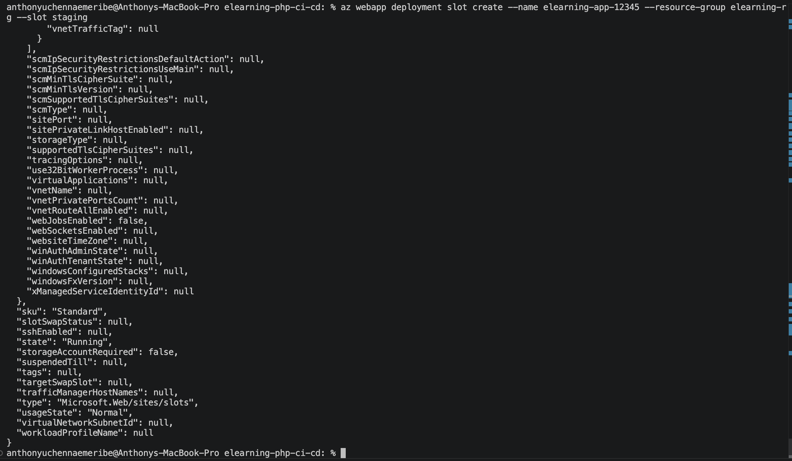
---

# Step 2 — Add GitHub Secrets

1. Add the following repository secrets:

```text
AZURE_WEBAPP_NAME
AZURE_CREDENTIALS
```
2. Run:
```bash
gh secret set AZURE_WEBAPP_NAME --body "elearning-app-12345"
```


3. Add Azure Credentials (Required for Swap)

1. Create service principal:
```bash
az ad sp create-for-rbac --name "github-actions-sp" --role contributor --scopes subscriptions/ecca4df5-3dc5-42c3-b0a4-c704f3e13b1b/resourceGroups/elearning-rg --sdk-auth | gh secret set AZURE_CREDENTIALS
```
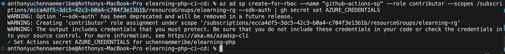

# Step 4 — Confirm repo path and verify GitHub Secrets
```bash
git remote -v
gh secret list
```
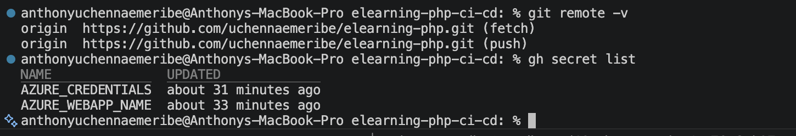

# Step 5 — Create Enterprise Workflow File

1. Create folder + file correctly
```bash
mkdir -p .github/workflows
touch .github/workflows/deploy.yml
nano .github/workflows/deploy.yml
```

2. GitHub Actions CI/CD Pipeline

File location:

```text
.github/workflows/deploy.yml
```

---

## Enterprise Deployment Pipeline

```yaml
name: Enterprise CI/CD - PHP Application

on:
  push:
    branches:
      - main

jobs:

  build:
    name: Build and Package Application
    runs-on: ubuntu-latest

    steps:

      - name: Checkout Source Code
        uses: actions/checkout@v4

      - name: Create Application Package
        run: zip -r app.zip .

      - name: Upload Build Artifact
        uses: actions/upload-artifact@v4
        with:
          name: php-app-package
          path: app.zip

  deploy-staging:
    name: Deploy to Staging Slot
    runs-on: ubuntu-latest
    needs: build

    steps:

      - name: Download Build Artifact
        uses: actions/download-artifact@v4
        with:
          name: php-app-package

      - name: Authenticate to Azure
        uses: azure/login@v2
        with:
          creds: ${{ secrets.AZURE_CREDENTIALS }}

      - name: Deploy Application to Azure Staging Slot
        run: |
          az webapp deployment source config-zip \
            --resource-group elearning-rg \
            --name ${{ secrets.AZURE_WEBAPP_NAME }} \
            --slot staging \
            --src app.zip

  swap-to-production:
    name: Swap Staging to Production
    runs-on: ubuntu-latest
    needs: deploy-staging

    steps:

      - name: Authenticate to Azure
        uses: azure/login@v2
        with:
          creds: ${{ secrets.AZURE_CREDENTIALS }}

      - name: Perform Zero-Downtime Slot Swap
        run: |
          az webapp deployment slot swap \
            --name ${{ secrets.AZURE_WEBAPP_NAME }} \
            --resource-group elearning-rg \
            --slot staging \
            --target-slot production
```
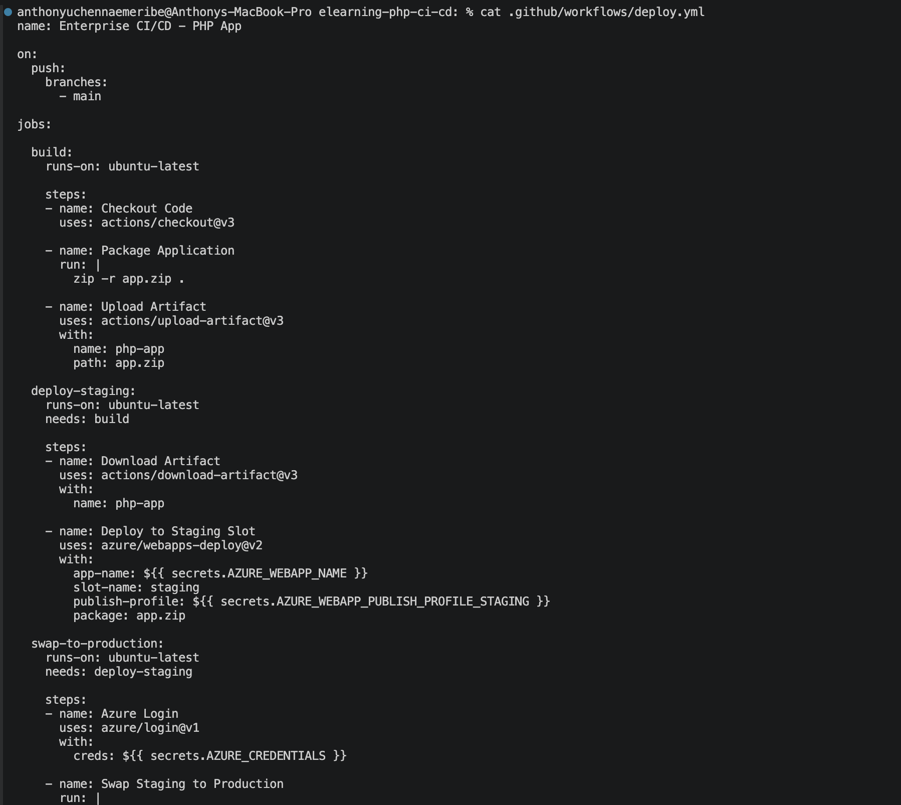

⸻

# Step 6 — Trigger Enterprise Pipeline
```bash
git add .
git commit -m "Upgrade to enterprise CI/CD pipeline"
git push origin main
```
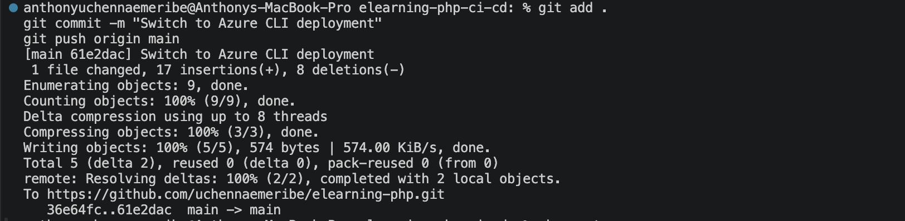

# PHASE 4 — Verify Deployment
1.  Verify GitHub Actions by going to:

```text
GitHub Repository → Actions
```

2. The workflow should run automatically.

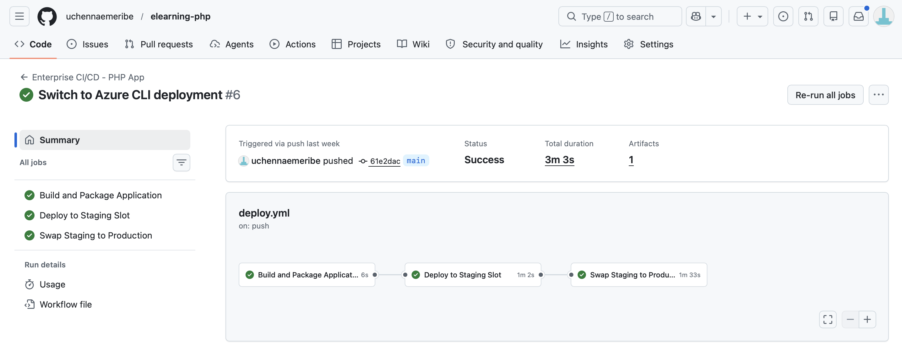

3. Visit:
```text
https://elearning-app-12345.azurewebsites.net
```


# PHASE 5 — Azure DNS Zone Configuration

## Create DNS Zone

```bash
az network dns zone create --resource-group elearning-rg --name auemeribetech.com.ng
```
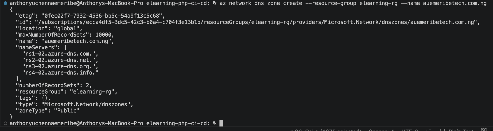
---

## Get Azure Nameservers
```bash
az network dns zone show --resource-group elearning-rg --name auemeribetech.com.ng --query nameServers -o tsv
```
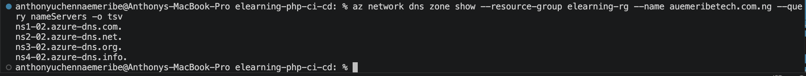
⸻

## PHASE 6 — Update Qservers Nameservers

1. Login to:
- QServers

2. Proceed to:
- My Domain

3. Click on:
- My Domain


4. Replace existing nameservers with Azure nameservers:
```text
ns1.qservers.net
ns2.qservers.net
```

5. With Azure:
```text
ns1-02.azure-dns.com
ns2-02.azure-dns.net
ns3-02.azure-dns.org
ns4-02.azure-dns.info
```
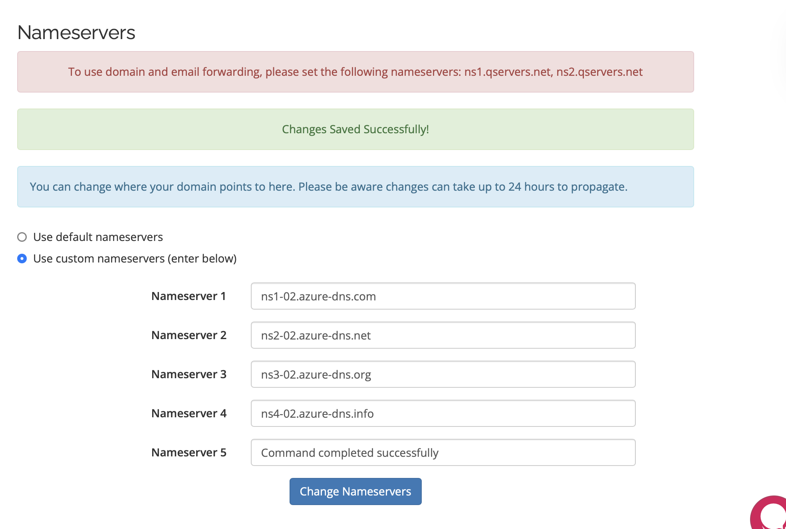

5. Wait for propagation

4. After approximately 10–15 minutes, verify that the domain is now using Azure DNS nameservers by running:

```bash
dig auemeribetech.com.ng NS
```
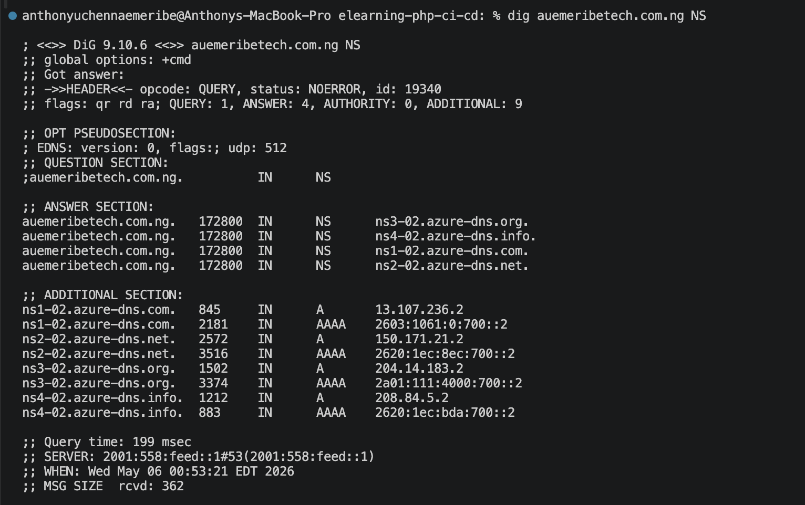

⸻

## PHASE 7 — Add Custom Domain in Azure

1. Create the TXT verification record
```bash
az network dns record-set txt add-record --resource-group elearning-rg --zone-name auemeribetech.com.ng --record-set-name asuid.www --value 01264d076f0ebed593c66a82ea991ac704f01d058b6fc7fbcc49d3cac10cf314
```
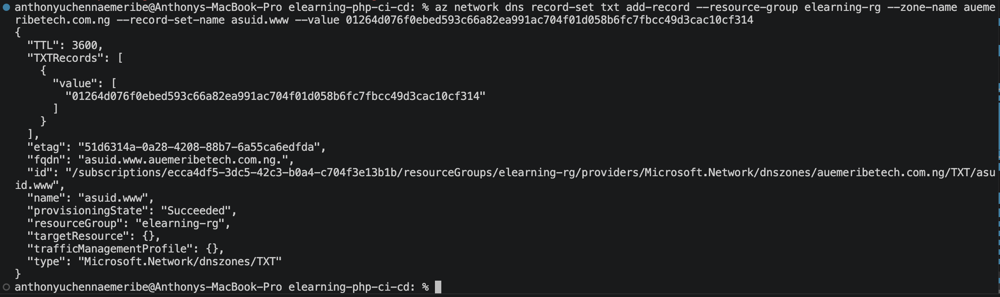

2. Then verify:
```bash
az network dns record-set txt show --resource-group elearning-rg --zone-name auemeribetech.com.ng --name asuid.www
```

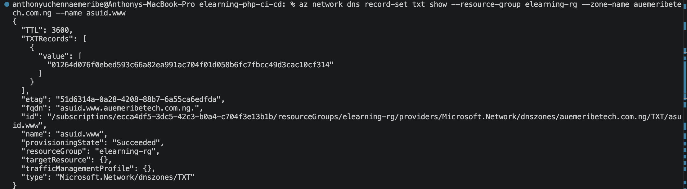

3. Create the hostname binding custom domain
```bash
az webapp config hostname add --webapp-name elearning-app-12345 --resource-group elearning-rg --hostname www.auemeribetech.com.ng
```

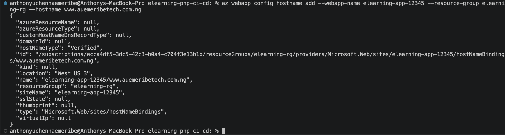

## PHASE 8 — Create DNS Records (Azure DNS)

## Create CNAME Record

```bash
az network dns record-set cname set-record --resource-group elearning-rg --zone-name auemeribetech.com.ng --record-set-name www --cname elearning-app-12345.azurewebsites.net

az network dns record-set cname set-record --resource-group elearning-rg --zone-name auemeribetech.com.ng --record-set-name www --cname elearning-app-12345.azurewebsites.net
```
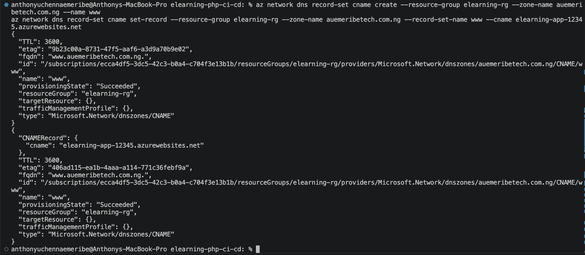
---

## TXT Record (Verification)

1. Get Domain Verification ID:
```bash
az webapp show --name elearning-app-12345 --resource-group elearning-rg --query customDomainVerificationId --output tsv
```
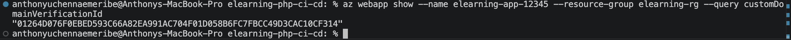

2. Then create TXT:
```bash
az network dns record-set txt create --resource-group elearning-rg --zone-name auemeribetech.com.ng --name asuid.www
```
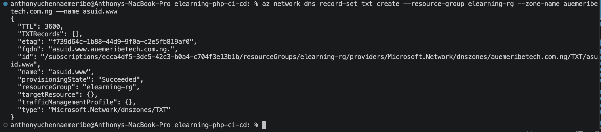
---

## Add TXT Verification Record

```bash
az network dns record-set txt add-record --resource-group elearning-rg --zone-name auemeribetech.com.ng --record-set-name asuid.www --value "<verification-id>"

# Substituting for "<verification-id>"
az network dns record-set txt add-record --resource-group elearning-rg --zone-name auemeribetech.com.ng --record-set-name asuid.www --value "01264D076F0EBED593C66A82EA991AC704F01D058B6FC7FBCC49D3CAC10CF314"
```
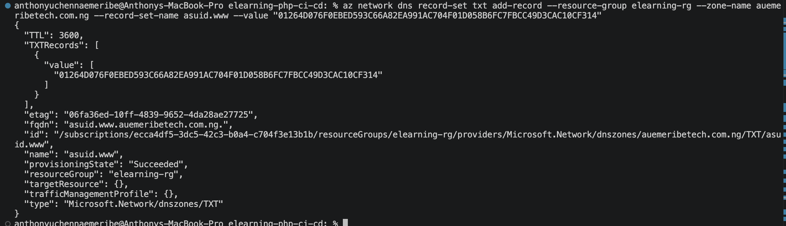


---
## PHASE 9 — DNS Propagation

1. Wait for 5–15 minutes

2. Verify DNS Propagation Completion by verifying TXT record by running this exact command repeatedly until it returns your TXT verification value:

```bash
nslookup -type=TXT asuid.www.auemeribetech.com.ng

# OR:
dig TXT asuid.www.auemeribetech.com.ng
```

3. DNS propagation is complete when you see something like:
```text
asuid.www.auemeribetech.com.ng text =
"01264D076F0EBED593C66A82EA991AC704F01D058B6FC7FBCC49D3CAC10CF314"
```
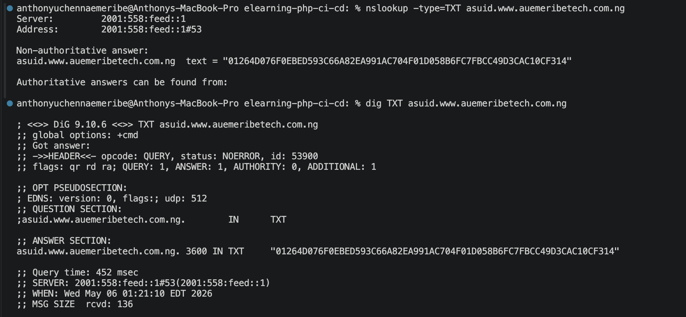

4. You should also verify the CNAME:
```text
nslookup www.auemeribetech.com.ng
```

5. Expected result:
```text
www.auemeribetech.com.ng canonical name = elearning-app-12345.azurewebsites.net
OR:
dig www.auemeribetech.com.ng
```
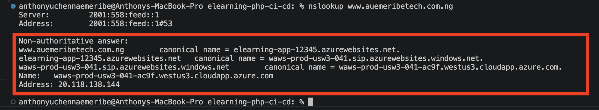
⸻
## PHASE 10 — Verify Domain
```bash
az webapp config hostname list --webapp-name elearning-app-12345 --resource-group elearning-rg
```
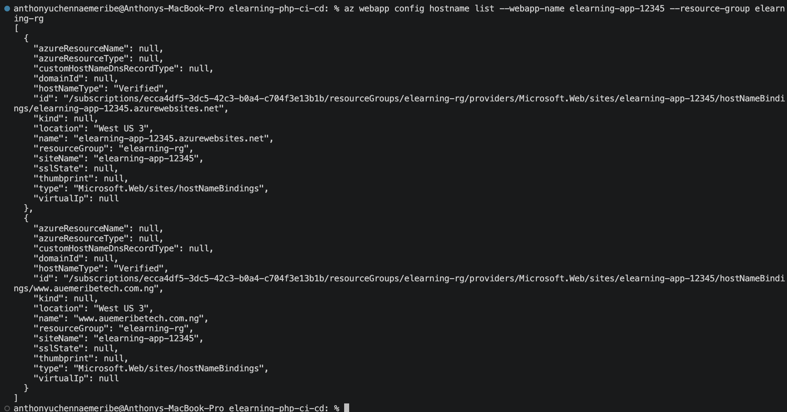
⸻

## PHASE 11 — Enable HTTPS

1. Create certificate
```bash
az webapp config ssl create --resource-group elearning-rg --name elearning-app-12345 --hostname www.auemeribetech.com.ng
```
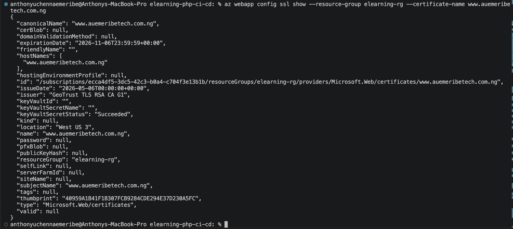
⸻

2. Get thumbprint
```bash
az webapp config ssl list --resource-group elearning-rg
```
⸻

3. Bind SSL
```bash
az webapp config ssl bind --certificate-thumbprint 40959A1B41F1B307FCB9284CDE294E37D230A5FC --ssl-type SNI --name elearning-app-12345 --resource-group elearning-rg
```
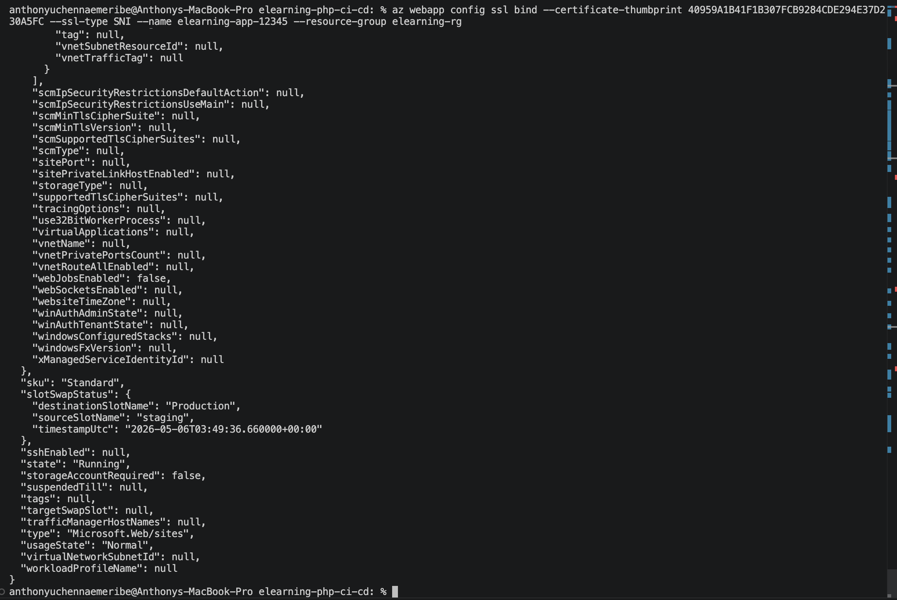
⸻

## PHASE 12 - FINAL TEST

1. Open:
```text
https://www.auemeribetech.com.ng
```
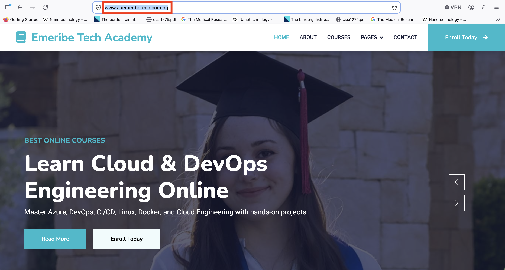

2. Commit and push to Update GitHub Repository
```bash
git add .
git commit -m "Add screenshots to README"
git push
```
---

# DevOps Features Implemented

- Automated CI/CD Pipeline
- Azure App Service Deployment
- Deployment Slots
- Zero-Downtime Releases
- Custom Domain Integration
- Azure DNS Automation
- HTTPS Support
- Service Principal Authentication
- Infrastructure Automation with Azure CLI

---

# Common Issues and Fixes

| Issue | Solution |
|---|---|
| Slot deployment fails | Verify staging slot exists |
| Custom domain verification fails | Check TXT record |
| GitHub Actions authentication fails | Verify AZURE_CREDENTIALS secret |
| DNS not resolving | Wait for DNS propagation |
| HTTPS unavailable | Ensure custom domain is bound |

---

# Cleanup Resources

```bash
az group delete --name elearning-rg --yes --no-wait
az group delete --name NetworkWatcher-rg --yes --no-wait
```
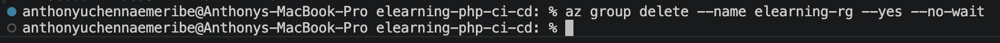
---

# Key DevOps Learnings

- CI/CD improves deployment reliability
- Deployment slots eliminate downtime
- Azure DNS simplifies domain management
- Service principals improve security
- GitHub Actions enables automation at scale

---

# Final Outcome

- Fully Automated CI/CD Pipeline
- Production-Ready Azure Architecture
- Zero-Downtime Deployment Strategy
- Enterprise Authentication Model
- Secure HTTPS Application Delivery

---

# Author

Anthony Uchenna Emeribe

Cloud / DevOps Engineer

---

# Support

If you found this project helpful, consider giving the repository a star.